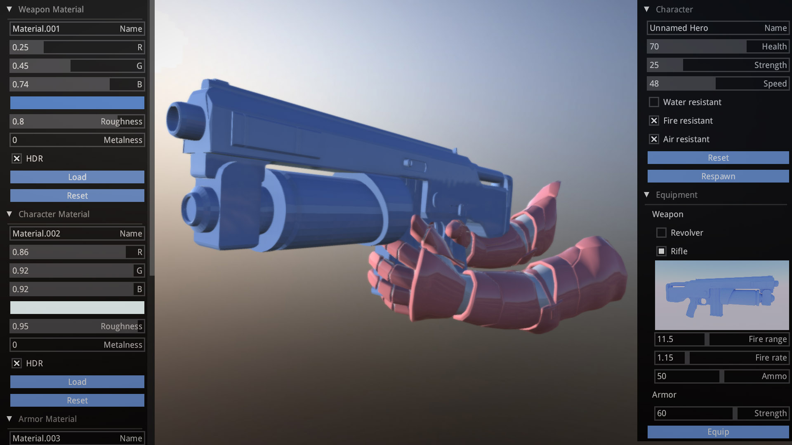

# zui

Immediate Mode Graphical User interface for Haxe Kha, mainly useful for tools or game debug. Can be used directly as Kha library included in khafile.js. Note that internally some of the state is retained to favor simplicity.  

Inspired by [imgui](https://github.com/ocornut/imgui).



## Getting started
- Clone into 'your_kha_project/Libraries'
- Add 'project.addLibrary('zui');' into khafile.js
``` hx
	// In init()
	var ui = new Zui(font);

	// In render()
	public function render(frame:Framebuffer) {
		var g = frame.g2;
		g.begin();
		// Draw your stuff...
		g.end();
		
		ui.begin(g);
		if (ui.window(Id.window(), x, y, w, h, Zui.LAYOUT_VERTICAL)) {
			if (ui.button("Hello")) {
				trace("World");
			}
		}
		ui.end();

		// Draw more stuff...
	}
```

## Elements
``` hx
node(id:String, text:String, accent = 1, expanded = false):Bool
image(image:Image)
text(text:String, align = ALIGN_LEFT, bg = 0)
textInput(id:String, text:String, label = ""):String
button(text:String):Bool
check(id:String, text:String, initState = false):Bool
radio(groupId:String, pos:Int, text:String, initState = 0):Bool
slider(id:String, text:String, from:Float, to:Float, filled = false, precision = 100, initValue = 0.0):Float

// Formating
row(ratios:Array<Float>)
separator()
indent()
unindent()
```

Ext.hx - prebuilt elements:
``` hx
list(...)
nodeList(...)
colorPicker(...)
```

Id.hx - simple macros to generate ids
``` hx
var state = check(Id.check(), "Check Box");
```

## Example
Check out test/ folder for small example projects.
