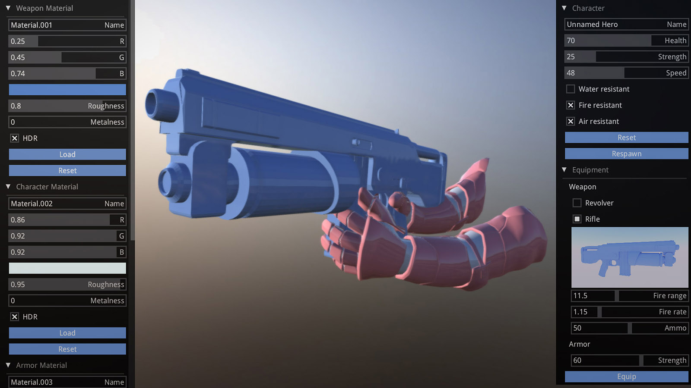
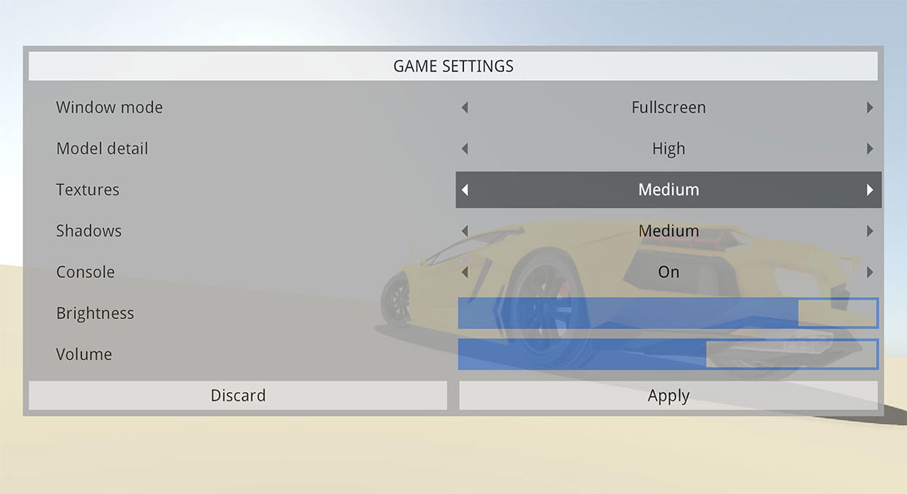
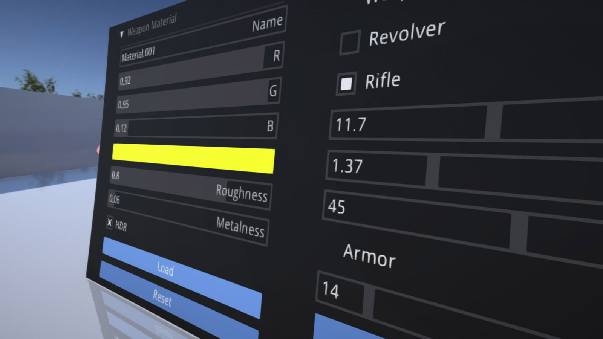

# zui

Immediate Mode Graphical User interface for Haxe Kha, mainly useful for tools or game debug. Can be used directly as Kha library included in khafile.js. Note that internally some of the state is retained to favor simplicity.  

Inspired by [imgui](https://github.com/ocornut/imgui).



## Getting started
- Clone into 'your_kha_project/Libraries' or do 'haxelib install zui'
- Add 'project.addLibrary('zui');' into khafile.js
``` hx
	// In init()
	var ui = new Zui(font:Font, fontSize = 17, fontSmallSize = 16, khaWindowId = 0, scaleFactor = 1.0);

	// In render()
	public function render(frame:Framebuffer) {
		var g = frame.g2;
		g.begin();
		// Draw your stuff...
		g.end();
		
		ui.begin(g);
		if (ui.window(Id.window(), x, y, w, h, Zui.LAYOUT_VERTICAL)) {
			if (ui.button("Hello")) {
				trace("World");
			}
		}
		ui.end();

		// Draw more stuff...
	}
```

## Elements
``` hx
node(id: String, text: String, accent = 1, expanded = false): Bool;
image(image: Image): Void;
text(text: String, align = Left, bg = 0): Void;
textInput(id: String, text: String, label = ""): String;
button(text: String): Bool;
check(id: String, text: String, initState = false): Bool;
radio(groupId: String, pos: Int, text: String, initState = 0): Bool;
inlineRadio(id: String, texts: Array<String>, initState = 0): Int;
slider(id: String, text: String, from: Float, to: Float, filled = false, precision = 100, initValue = 0.0, displayValue = true): Float;

// Formating
row(ratios: Array<Float>);
separator();
indent();
unindent();
```

Ext.hx - prebuilt elements:
``` hx
list(...);
nodeList(...);
colorPicker(...);
```

Id.hx - simple macros to generate ids
``` hx
var state = check(Id.check(), "Check Box");
```

## Examples
Check out examples/ folder. To run specific example, simply drop it's folder into [KodeStudio](https://github.com/KTXSoftware/KodeStudio/releases) and hit run.
  
Generated API docs are available [here](http://luboslenco.github.io/zui/zui/index.html).

## Theming
You can customize theme fairly easily, but currently only by editing constants. This will be improved in the future. Check the example theme sources [here](https://github.com/luboslenco/zui/tree/master/Sources/zui/theme).
  


## Custom integration
Thanks to the powerful render target system of Kha, it is possible to easily integrate the library into any situation. Before creating a new Zui() instance, set Zui.autoNotifyMouseEvents to false. You can then manually process the input and render the resulting texture in any way you may need.
``` hx
zui.onMouseDown(button:Int, x:Int, y:Int)
zui.onMouseUp(button:Int, x:Int, y:Int)
zui.onMouseMove(x:Int, y:Int, movementX:Int, movementY:Int)
zui.onMouseWheel(delta:Int)
```

